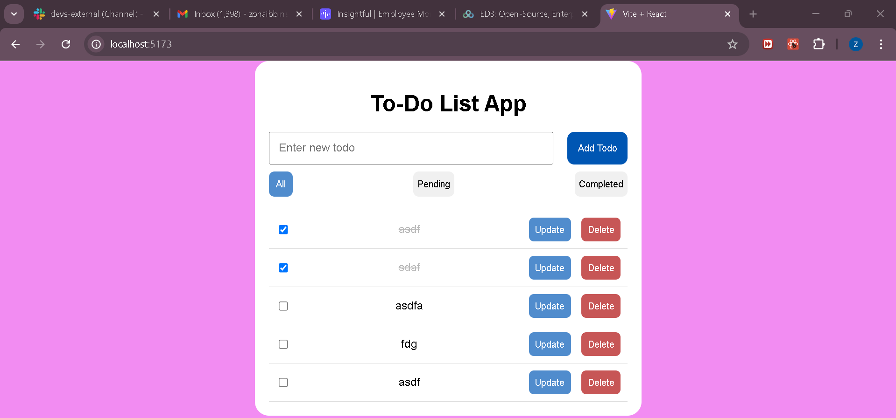
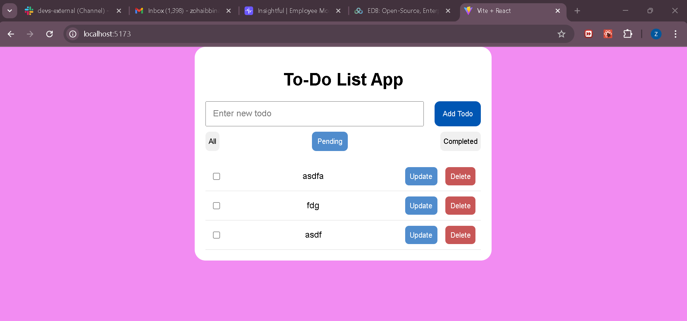
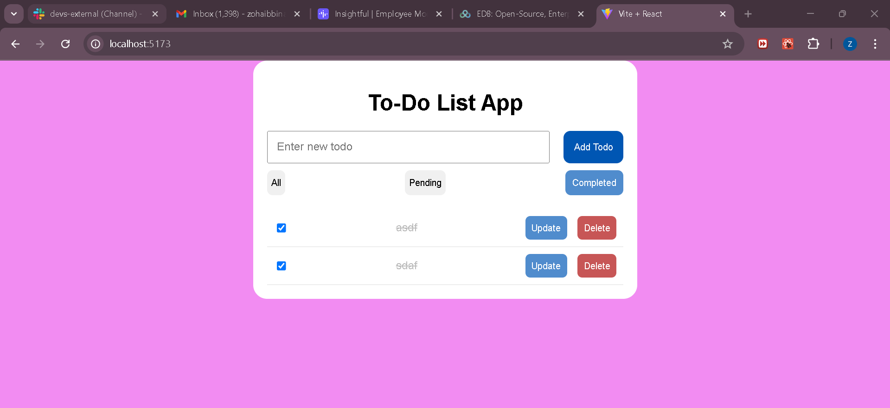
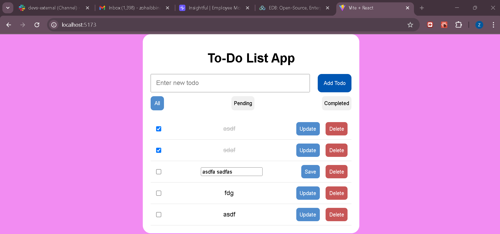
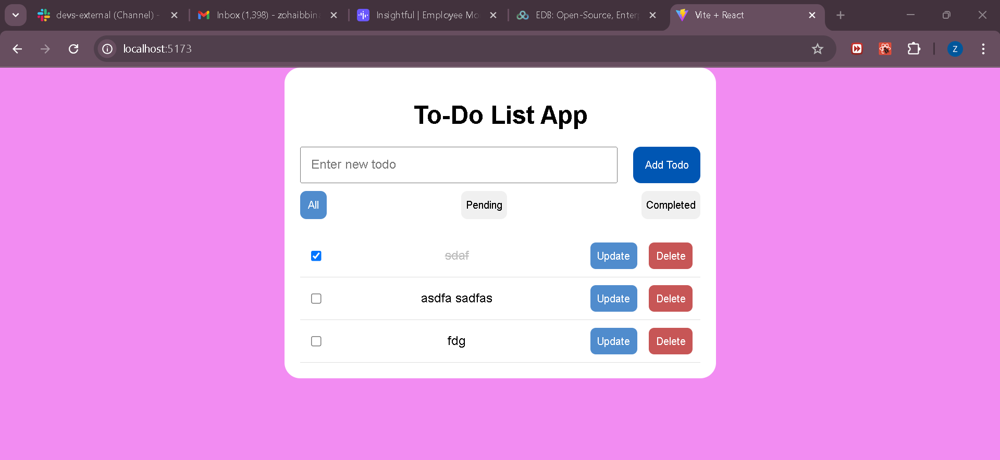

# To-Do List App

This is a simple and user-friendly task management app that helps users track their to-do list.

## There is an two folders:

- 1: frontend
- 2: backend

## There are screens shots of app.

- All Todos
  

- Pending Todos
  
- Completed Todos => To implement the feature where completed todos can be deleted but cannot be updated until the user marks them as incomplete
  

- Updated Todo
  

- After deletion of 2 todos
  
